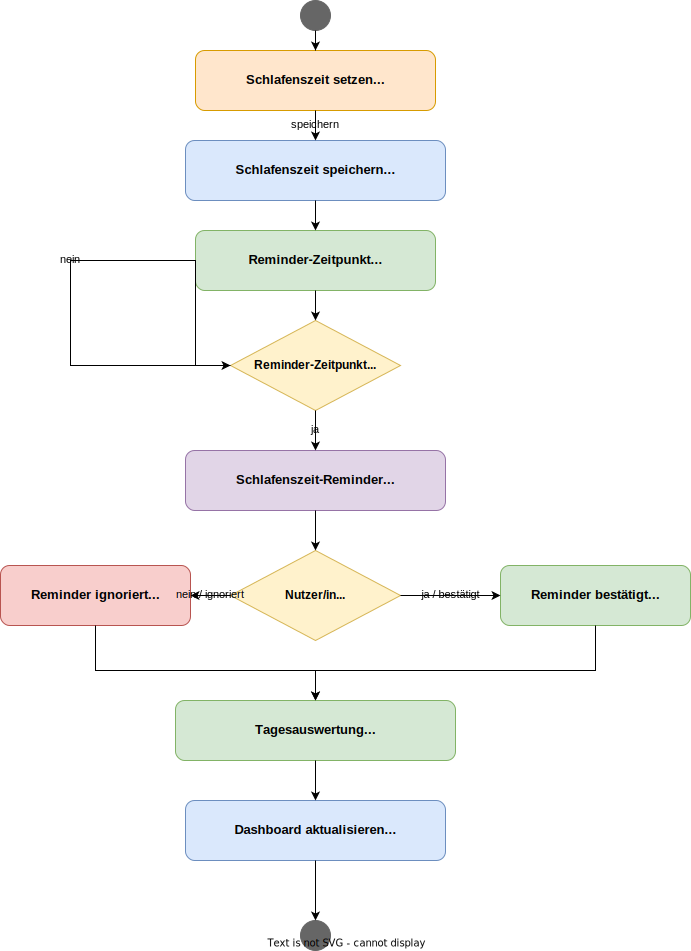

# Lastenheft - Return to Monkee (MVP)

## 1. Einleitung

Dieses Lastenheft beschreibt die fachlichen und organisatorischen Anforderungen an das Projekt **Return to Monkee**. Ziel des Dokuments ist es, den erwarteten Leistungsumfang aus Sicht des Auftraggebers klar, nachvollziehbar und umsetzungsnah zu definieren. Dabei wird bewusst eine Form gewählt, die sowohl im akademischen Kontext als auch in der praktischen Projektarbeit nutzbar ist.

Return to Monkee ist als App für digitale Gesundheit konzipiert. Im Mittelpunkt steht die Unterstützung junger Menschen dabei, ihre Mediennutzung bewusster zu steuern und gesündere Routinen rund um Bildschirmzeit, Schlafenszeit und Bewegungspausen aufzubauen. Die Anwendung ist ausdrücklich **kein** medizinisches Produkt und ersetzt keine Therapie oder Diagnostik.

## 2. Ausgangssituation und Problemstellung

Viele Nutzerinnen und Nutzer im Alter von etwa 16 bis 30 Jahren verbringen einen erheblichen Teil ihres Alltags an digitalen Endgeräten. Typische Folgen sind übermäßige Bildschirmzeit, verschobene Schlafenszeiten, ausbleibende Bewegungspausen und das Gefühl, den eigenen digitalen Konsum nicht ausreichend steuern zu können. Gleichzeitig sind viele bestehende digitale Angebote auf Bindung und Aufmerksamkeit optimiert, statt auf langfristig gesundes Nutzungsverhalten.

Das Projekt adressiert damit ein klar umrissenes Praxisproblem: Es fehlt eine niedrigschwellige, alltagstaugliche und motivierende Anwendung, die Verhalten sichtbar macht, Regeln strukturiert abbildet und Fortschritt verständlich rückmeldet, ohne den Charakter einer reinen Kontroll- oder Straf-App anzunehmen.

## 3. Zielsetzung des Projekts

Das übergeordnete Ziel ist die Entwicklung eines vorzeigbaren und fachlich belastbaren MVPs, der Kernmechaniken zur Selbstregulation digitaler Nutzung implementiert und als Grundlage für spätere Erweiterungen dient. Das Produktziel ist plattformunabhängig (Android und iOS), wobei die erste Umsetzung technisch **Android-first** erfolgt und iOS anschließend nachgezogen wird.

Die App soll im MVP insbesondere:

- digitale Gewohnheiten transparent machen
- individuelle Nutzungsregeln ermöglichen
- an Schlafenszeiten erinnern
- Bewegungspausen regelmäßig anstoßen
- Fortschritte über Tageswerte und 7-Tage-Trends visualisieren
- durch Soft-Interventionen zur Reflexion anregen

## 4. Projektbeteiligte und Rollen

Die Projektorganisation basiert auf einem Scrum-orientierten Vorgehen. Für den aktuellen Projektstand sind folgende Rollen festgelegt:

- **Product Owner:** Alex Schiebelhut
- **Scrum Master:** Tajan Biazevic

Weitere im Projektkontext genannte Teilnehmende:

- Artem Grauberger
- Christopher Drewes
- Jonas Weirauch
- Leon Sudermann
- Morris Freihoff

Hinweis: Die weiteren Teammitglieder sind in der aktuellen Projektphase in der Rolle Entwicklung eingeordnet. Eine feinere Aufteilung (z. B. Feature-Ownership, Testverantwortung, Dokumentationsverantwortung) erfolgt sprintweise.

## 5. Produktvision und Abgrenzung

Return to Monkee soll nicht durch harte Sanktionen dominieren, sondern durch Orientierung, Aktivierung und Selbstreflexion. Das bedeutet, dass der MVP bewusst mit **Soft-Interventionen** arbeitet (Hinweis, Reflexionsimpuls, Alternativhandlung), während harte Sperrmechanismen nur als mögliche spätere Ausbaustufe betrachtet werden.

Die Anwendung bleibt im MVP lokal und datensparsam:

- keine Benutzerkonten
- keine Cloud-Synchronisierung
- keine soziale Vernetzung
- keine KI-basierte Gesundheitsberatung

Damit wird ein fokussierter, realistischer und technisch kontrollierbarer Lieferumfang sichergestellt.

## 6. Zielgruppe

Primäre Zielgruppe sind junge Menschen im Alter von ca. 16 bis 30 Jahren, insbesondere Schülerinnen und Schüler, Studierende, Auszubildende und junge Berufstätige mit hoher Smartphone- und Mediennutzung.

Die Zielgruppe zeichnet sich im Kontext dieses Projekts durch folgende Merkmale aus:

- hohe Exposition gegenüber Social Media, Streaming und Gaming
- alltagsnahe Herausforderungen bei Schlafrhythmus und Selbstorganisation
- Bedarf an niedrigschwelliger, nicht-stigmatisierender Unterstützung

## 7. Rahmenbedingungen und Leitplanken

Der MVP wird unter folgenden Leitplanken geplant:

- Architektur: modularer Monolith
- Technologie: .NET MAUI als primäre Entwicklungsbasis
- Datenhaltung: lokale SQLite-Datenbank
- Vorgehen: iterativ, Scrum-orientiert
- Datenschutz: lokale Speicherung und Löschbarkeit der Daten

Die technische Integrationsstrategie für reale Nutzungsdaten (plattformnahe APIs) wird als Folgephase behandelt und ist nicht Bestandteil der ersten MVP-Realisierung.

## 8. Funktionale Anforderungen

Die funktionalen Anforderungen beschreiben, welche Leistungen die App aus Anwendersicht erbringen muss. Dabei liegt der Fokus auf drei End-to-End-Kern-Workflows, die im MVP stabil funktionieren müssen.

### 8.0 Mini-Inhaltsverzeichnis Funktionale Anforderungen

- FR-01: Onboarding
- FR-02: Regelverwaltung
- FR-03: Zeitlimit-Workflow (simuliert)
- FR-04: Schlafenszeit-Erinnerung
- FR-05: Bewegungs- und Pausen-Reminder
- FR-06: Dashboard
- FR-07: Statistikbereich
- FR-08: Soft-Interventionen

### 8.1 (FR-01) Onboarding

Beim ersten Start soll ein schlankes Onboarding durchführbar sein, das in unter zwei Minuten abgeschlossen werden kann. Das Onboarding soll die initiale Konfiguration vereinfachen und den Einstieg in die Kernfunktionen sicherstellen.

Pflichtinhalte:

- persönliche Zielausrichtung wählen (z. B. weniger Social Media, besser schlafen, mehr Pausen)
- Schlafenszeit setzen
- Bewegungsintervall festlegen (30/60/90 Minuten, Standard 60)
- erste Zeitlimit-Regel anlegen

### 8.2 (FR-02) Regelverwaltung

Nutzerinnen und Nutzer sollen Regeln für ihr digitales Verhalten erstellen, bearbeiten, aktivieren und deaktivieren können. Eine Regel kann sich auf eine Kategorie beziehen und ein tägliches Limit definieren.

MVP-Kategorien:

- Social Media
- Video/Streaming
- Gaming
- Sonstiges

Wesentliche Funktionen:

- neue Regel erstellen
- bestehende Regel bearbeiten
- Regel aktiv/inaktiv schalten
- Regelstatus in Übersicht sichtbar machen

### 8.3 (FR-03) Zeitlimit-Workflow (simuliert)

Da plattformweite Echtzeit-Auswertung im MVP nicht final integriert ist, wird die Nutzungserfassung zunächst simuliert/manuell abgebildet. Dennoch muss der Ablauf fachlich vollständig sein.

Erforderlicher Ablauf:

- Limit wird in der Regelverwaltung hinterlegt
- Tagesstatus zeigt verbleibenden/erreichten Zustand
- Überschreitung kann markiert bzw. erkannt werden
- Soft-Intervention wird ausgelöst
- Ergebnis wird im Dashboard und in der Statistik erfasst

### 8.4 (FR-04) Schlafenszeit-Erinnerung

Nutzerinnen und Nutzer hinterlegen eine individuelle Schlafenszeit. Vor dieser Zeit erfolgt ein Reminder mit dem Ziel, digitale Aktivitäten bewusst zu beenden.

Erforderlich:

- Schlafenszeit setzen und ändern
- Erinnerung vor Schlafenszeit auslösen
- Bestätigung der Erinnerung erfassen
- Tagesauswertung zur Einhaltung anzeigen

### 8.5 (FR-05) Bewegungs- und Pausen-Reminder

Die App soll in wiederkehrenden Intervallen an kurze Bewegungspausen erinnern. Nutzer können Reminder bestätigen oder ignorieren; beides wird statistisch verarbeitet.

Erforderlich:

- Intervallsteuerung 30/60/90 Minuten (Default 60)
- Reminder auslösen
- Bestätigt/ignoriert erfassen
- Tagesfortschritt aktualisieren

### 8.6 (FR-06) Dashboard

Das Dashboard dient als zentrale Übersichtsseite und zeigt den aktuellen Tageskontext in komprimierter Form. Nutzerinnen und Nutzer sollen ohne tiefes Navigieren erfassen können, wie sie im Tagesverlauf stehen.

Pflichtinhalte:

- aktive Regeln
- heutiger Zielstatus
- nächste Erinnerungen
- Kennzahlen zum Tagesfortschritt

### 8.7 (FR-07) Statistikbereich

Der Statistikbereich soll Verhalten über den Tag hinaus sichtbar machen und Motivation durch messbaren Fortschritt erzeugen.

Pflichtmetriken:

- eingehaltene Zeitlimits (pro Tag)
- überschrittene Zeitlimits (pro Tag)
- bestätigte Bewegungspausen (pro Tag)
- ignorierte Reminder (pro Tag)
- Schlafenszeit-Reminder bestätigt (pro Tag)
- 7-Tage-Trend (einfache Verlaufsdarstellung)

### 8.8 (FR-08) Soft-Interventionen

Bei Regelverletzungen oder kritischen Nutzungsmustern soll die App nicht sanktionieren, sondern zur bewussten Entscheidung anregen.

Interventionselemente:

- deutlicher Hinweis
- kurze Reflexionsfrage
- Vorschlag einer Alternativhandlung

Hinweis: Harte Sperrmechanismen sind im MVP nicht gefordert und bleiben als spätere Option dokumentiert.

## 9. Nicht-funktionale Anforderungen

Neben dem fachlichen Umfang sind qualitative Anforderungen entscheidend, damit der MVP nutzbar, vorzeigbar und erweiterbar ist.

### 9.0 Mini-Inhaltsverzeichnis Nicht-funktionale Anforderungen

- NFR-01: Benutzbarkeit
- NFR-02: Zuverlässigkeit und Stabilität
- NFR-03: Performance
- NFR-04: Wartbarkeit und Erweiterbarkeit
- NFR-05: Datenschutz und Datensouveränität

### 9.1 (NFR-01) Benutzbarkeit

Die Bedienung soll einfach, klar und ohne Fachwissen möglich sein. Wesentliche Aktionen (Regel anlegen, Schlafenszeit setzen, Reminder bestätigen) müssen selbsterklärend sein.

Leitpunkte:

- Onboarding < 2 Minuten
- geringer Navigationsaufwand
- verständliche Formulierungen ohne moralischen Druck

### 9.2 (NFR-02) Zuverlässigkeit und Stabilität

Die Anwendung muss in einer Demo-Situation belastbar funktionieren. Kritische Fehler in Kernabläufen sind zu vermeiden.

Abnahmepunkt:

- kein kritischer Absturz während eines 15-minütigen Demo-Flows auf Android

### 9.3 (NFR-03) Performance

Interaktionen im MVP sollen reaktionsschnell erfolgen. Startzeiten und Screenwechsel müssen für eine mobile Anwendung angemessen sein.

### 9.4 (NFR-04) Wartbarkeit und Erweiterbarkeit

Die modulare Struktur soll spätere Erweiterungen ermöglichen, insbesondere:

- API-basierte Nutzungserfassung
- iOS-Nachzug der Android-first-Umsetzung
- mögliche spätere Streng-Interventionen

### 9.5 (NFR-05) Datenschutz und Datensouveränität

Nutzungs- und Verhaltensdaten gelten als sensibel. Der MVP verfolgt deshalb einen local-first-Ansatz.

Verbindliche Punkte:

- Daten bleiben lokal auf dem Gerät
- kein Konto erforderlich
- kein Cloud-Sync
- Funktion „Alle Daten löschen“ in den Einstellungen

## 10. Produktgrenzen und Nicht-Ziele (MVP)

Zur Vermeidung von Überfrachtung werden folgende Punkte explizit ausgeschlossen:

- medizinische Diagnostik, Therapie oder Behandlungsempfehlungen
- KI-basierte Gesundheitsberatung
- vollständige plattformweite App-Sperrung im MVP
- vollständige native App-Usage-API-Integration im MVP
- soziale Funktionen, Freundeslisten, Community-Features
- Gamification mit komplexen Belohnungssystemen

## 11. Fachliches Datenkonzept (MVP)

Für die Umsetzung wird ein lokales Datenmodell benötigt, das Regeln, Ereignisse und Auswertungen konsistent abbildet. Die fachliche Entitätslogik orientiert sich an den bereits abgestimmten Kernobjekten.

Geplante Kernobjekte:

- UserSettings
- UsageRule
- Reminder
- ActivitySuggestion
- UserEvent
- DailyStatistic

Die genaue physische Modellierung (Tabellen, Schlüssel, Constraints) erfolgt im Pflichtenheft bzw. technischen Umsetzungskonzept.

## 12. System- und Architekturkontext

Die Anwendung wird als modularer Monolith geplant. Dadurch bleibt die fachliche Trennung klar, ohne die Komplexität verteilter Systeme vorzeitig einzuführen.

Fachmodule (Sollstruktur):

- UI/Presentation
- Rule Management
- Timer/Scheduler
- Notification Adapter
- Intervention Engine
- Statistics Module
- Persistence Layer
- Platform Services (später erweitert)

## 13. Qualitätssicherung und Abnahmekriterien

Die Qualitätssicherung orientiert sich am extern sichtbaren Verhalten. Kernkriterium ist nicht die interne Implementierungsart, sondern die verlässliche Erfüllung der fachlichen Anforderung.

MVP gilt als fachlich erfolgreich, wenn:

- Onboarding in unter 2 Minuten abgeschlossen werden kann
- alle 3 Kern-Workflows end-to-end funktionieren
- Dashboard den Tagesstatus korrekt abbildet
- Statistik Tageswerte und 7-Tage-Trend korrekt darstellt
- in einem 15-Minuten-Android-Demoablauf kein kritischer Absturz auftritt

## 14. Risiken und Annahmen

Das Projekt adressiert mehrere bekannte Risiken, die aktiv gesteuert werden müssen.

Wesentliche Risiken:

- plattformspezifische Unterschiede bei Background- und Notification-Verhalten
- spätere API-Integration kann Architekturentscheidungen nachschärfen
- zu großer MVP-Umfang gefährdet Lieferfähigkeit

Zentrale Annahmen:

- Android-first reduziert initiales Risiko
- simulierte Nutzungserfassung ist für MVP-Demo ausreichend
- klare Modulgrenzen erleichtern spätere iOS- und API-Erweiterung

## 15. Meilensteinorientierte MVP-Umsetzung (fachlich)

Die Umsetzung soll in logisch aufeinander aufbauenden Lieferinkrementen erfolgen.

Vorgeschlagene Reihenfolge:

1. Projektbasis und Persistenzgrundlagen
2. Onboarding und Regelverwaltung
3. Schlafenszeit- und Bewegungs-Reminder
4. Dashboard-Integration
5. Statistikmodul inkl. 7-Tage-Trend
6. Stabilisierung, Test und Demo-Hardening

## 16. Diagramme

Die Aufnahme von Diagrammen ist für dieses Projekt sehr sinnvoll, insbesondere zur Abstimmung im Team und zur Dokumentation für spätere Entwicklungsphasen. Die Diagramme wurden nach Diagrammtyp in eigene Ordner unter `docs/diagramme/` aufgeteilt, damit die Struktur übersichtlich bleibt.

Die folgenden Diagramme sind Teil des aktuellen Lastenheft-Stands. Die eingebetteten SVG-Dateien dienen der direkten Lesbarkeit im Dokument; die verlinkten Draw.io-Dateien bleiben die bearbeitbaren Quellen.

### 16.1 Systemkontextdiagramm

Quelle:

- [Systemkontextdiagramm_v2.drawio](../diagramme/systemkontext/Systemkontextdiagramm_v2.drawio)

Das Systemkontextdiagramm zeigt Return to Monkee im Nutzungskontext des MVP. Im Mittelpunkt stehen der Nutzer, das mobile Gerät als Laufzeitumgebung, lokale Datenhaltung und plattformnahe Benachrichtigungen.

Fachliche Kernaussagen:

- App im Nutzungskontext mit Nutzer als Primärakteur
- mobiles Gerät bzw. Betriebssystem als Laufzeitumgebung
- lokale SQLite-Datenhaltung für Regeln, Events und Statistiken
- OS-Notification-Service als externe plattformnahe Abhängigkeit
- explizite MVP-Abgrenzung: kein Backend, kein Account, keine Cloud-Synchronisierung, keine echte App-Sperrung

### 16.2 Anwendungsfall-Diagramm (Use Cases)

Quelle:

- [UseCase_Diagramm_MVP_v2.drawio](../diagramme/use-cases/UseCase_Diagramm_MVP_v2.drawio)

Das Anwendungsfall-Diagramm beschreibt die fachlichen Interaktionen des Nutzers mit dem MVP. Es macht sichtbar, welche Kernfunktionen für die erste nutzbare Version relevant sind und welche Nutzungssituationen durch die App unterstützt werden.

Fachliche Kernaussagen:

- fachliche MVP-Anwendungsfälle des Nutzers
- Setup und Onboarding
- Regeln und Zeitlimits
- Schlafenszeit- und Bewegungs-Reminder
- Soft-Interventionen
- Dashboard, Statistik und 7-Tage-Trend
- lokale Datenkontrolle und Löschung

### 16.3 Modulübersicht (Architektur-Sicht)

Quelle:

- [Moduluebersicht_MVP_v2.drawio](../diagramme/moduluebersicht/Moduluebersicht_MVP_v2.drawio)

Die Modulübersicht ordnet die fachlichen und technischen Verantwortlichkeiten des MVP. Sie dient als Brücke zwischen Lastenheft, späterem Pflichtenheft und Umsetzung im .NET-MAUI-Projekt.

Fachliche Kernaussagen:

- modularer Monolith mit fachlichen Komponenten und Verantwortlichkeiten
- UI/Presentation, Onboarding, Rule Engine, Reminder Scheduler, Intervention Engine, Statistics Aggregator, Settings/Data Control
- technische Kapselung über Notification Adapter, Platform Services Abstraction und Persistence Facade
- lokale SQLite-Persistenz und MVP-Abgrenzung zu Backend, Cloud, Usage-API und echter App-Sperrung

### 16.4 Aktivitätsdiagramm Zeitlimit-Workflow

Quelle:

- [Aktivitätsdiagramm-Zeitlimit-Workflow.drawio](../diagramme/Aktivitätsdiagramme/Aktivitätsdiagramm-Zeitlimit-Workflow.drawio)

Das Aktivitätsdiagramm beschreibt den Ablauf vom Prüfen eines Zeitlimits bis zur Soft-Intervention. Es verdeutlicht, dass der MVP den Nutzer erinnert und sensibilisiert, aber keine echte App-Sperrung erzwingt.

Fachliche Kernaussagen:

- Zeitlimit-Regeln werden gegen lokal bekannte Nutzungs- bzw. Ereignisdaten geprüft
- bei erreichter Grenze wird eine bewusst weiche Intervention ausgelöst
- der Nutzer kann auf die Erinnerung reagieren, ohne technisch blockiert zu werden
- die MVP-Abgrenzung zur echten Betriebssystem-App-Sperre bleibt explizit erhalten

### 16.5 Aktivitätsdiagramm Bewegungspausen-Workflow

Quelle:

- [Aktivitätsdiagramm-Reminder-Statistik-Workflow.drawio](../diagramme/Aktivitätsdiagramme/Aktivitätsdiagramm-Reminder-Statistik-Workflow.drawio)

Das Aktivitätsdiagramm beschreibt den fachlichen Ablauf für Bewegungspausen-Erinnerungen. Es zeigt, wie geplante oder konfigurierte Pausen in eine Benachrichtigung und eine einfache Nutzerreaktion überführt werden.

Fachliche Kernaussagen:

- Bewegungspausen werden lokal geplant und über Benachrichtigungen angestoßen
- der Nutzer erhält eine niedrigschwellige Erinnerung statt einer verpflichtenden Aufgabe
- bestätigte oder ignorierte Erinnerungen können als Ereignisse für einfache Statistiken genutzt werden
- der Workflow bleibt MVP-tauglich und verzichtet auf komplexe Sensorik oder Gesundheitsplattform-Integration

### 16.6 Aktivitätsdiagramm Schlafenszeit-Workflow

Quelle:

* [Aktivitätsdiagramm-Schlafenszeit-Workflow.drawio](../diagramme/Aktivitätsdiagramme/Aktivitätsdiagramm-Schlafenszeit-Workflow.drawio)

Das Aktivitätsdiagramm beschreibt den fachlichen Ablauf der Schlafenszeit-Erinnerung. Es zeigt, wie eine gesetzte Schlafenszeit in einen geplanten Reminder überführt wird und wie die Reaktion des Nutzers anschließend für Dashboard und Statistik ausgewertet werden kann.

Fachliche Kernaussagen:

* die Schlafenszeit wird lokal gesetzt bzw. geändert und als Einstellung gespeichert
* der Reminder-Zeitpunkt wird aus der hinterlegten Schlafenszeit abgeleitet
* die Erinnerung wird als Soft-Intervention ausgelöst und kann bestätigt oder ignoriert werden
* bestätigte und ignorierte Reminder werden als Ereignisse für Tagesauswertung und Statistik verarbeitet
* der Workflow bleibt MVP-tauglich, da keine medizinische Bewertung und keine harte App-Sperrung erfolgt

### 16.7 Weitere geplante Diagramme

Für spätere Projektphasen sind weitere Diagramme sinnvoll:

* Fachliches Datenmodell / ER-Skizze
* detaillierte Sequenzdiagramme für Benachrichtigungen und Statistikaggregation

## 17. Zusammenfassung

Dieses Lastenheft definiert den fachlichen Soll-Zustand für den MVP von Return to Monkee. Es verbindet klare Produktziele mit einem realistischen Lieferumfang und berücksichtigt sowohl technische Machbarkeit als auch Datenschutz- und Nutzbarkeitsaspekte. Durch die Android-first-Strategie bei gleichzeitig plattformunabhängigem Produktanspruch wird ein kontrollierter, aber zukunftsfähiger Einstieg geschaffen. Das Dokument bildet damit die belastbare Grundlage für die weitere Ausarbeitung von Pflichtenheft, technischer Umsetzung und GitHub-Issue-Struktur.
